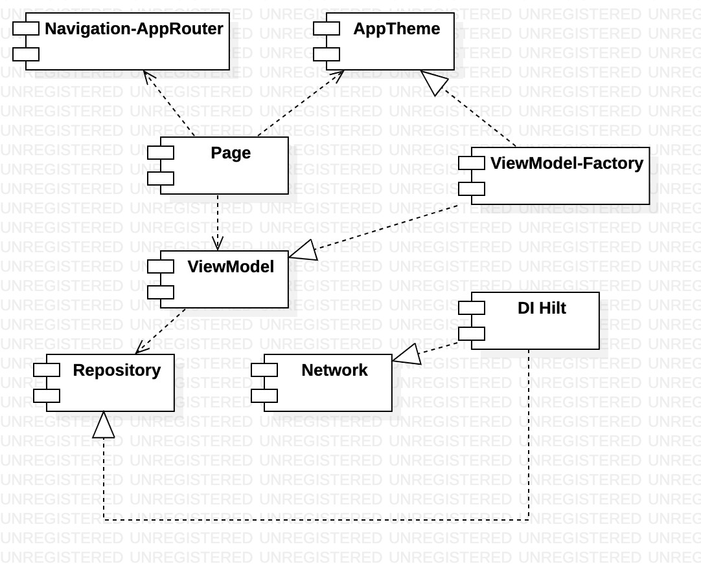
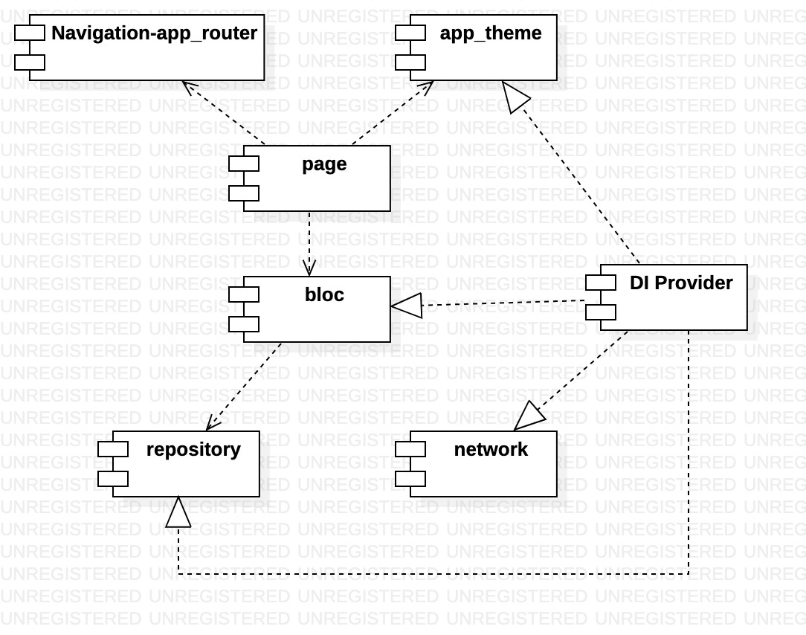

# Android Jetpack Compose via Flutter

|  Compose   | Flutter  |
|  ----  | ----  |
|   |   |

# General similarity comparison

1. Show image
2. Show App-bar(topbar in Compose, appbar in Flutter)
3. Show render text and theme, styles...
4. App's navigation approach

|     |  Compose   | Flutter  |
|  ----  |  ----  | ----  |
| App entry point  | [MainActivity.kt](android/app/src/main/java/com/example/composelambda/MainActivity.kt)  |  [main.dart](flutter/lib/main.dart) |
| App's navigation   | [AppRouter.kt](android/app/src/main/java/com/example/composelambda/appNav/AppRouter.kt)  | [app_router.dart](flutter/lib/app_nav/app_router.dart) (flutter navigation 1.0)  |
| List UI  | [OverviewPage.kt](android/app/src/main/java/com/example/composelambda/pages/OverviewPage.kt)  | [overview_page.dart](flutter/lib/pages/overview_page.dart)  |
| Detail UI  | [DetailPage.kt](android/app/src/main/java/com/example/composelambda/pages/DetailPage.kt)  | [detail_page.dart](flutter/lib/pages/detail_page.dart)  |
| Preferences UI | [PreferencesPage](android/app/src/main/java/com/example/composelambda/pages/PreferencesPage.kt)| [preferences_page.dart](flutter/lib/pages/detail_page.dart)  |
| Screen transition  | call places `Crossfade` in [AppRouter.kt](android/app/src/main/java/com/example/composelambda/appNav/AppRouter.kt)   | call places [ScaleTransitionPageRoute](flutter/lib/transitions/customized_transition_route.dart) of [customized_transition_route](flutter/lib/transitions/customized_transition_route.dart) in [app_router.dart](flutter/lib/app_nav/app_router.dart)   |
| Simply state  | Check `delta` to change font-size in [DetailPage.kt](android/app/src/main/java/com/example/composelambda/pages/DetailPage.kt)  |  check `_delta` to change font-size [detail_page.dart](flutter/lib/pages/detail_page.dart). |
| Complex state | Check `AppTheme` [AppTheme.kt](android/app/src/main/java/com/example/composelambda/AppTheme.kt) and `BuildSwitchTheme` in [AppBar.kt](android/app/src/main/java/com/example/composelambda/pages/AppBar.kt) by using `AppThemeModel` | Check `ThemeApp` [app_theme.dart](flutter/lib/app_theme.dart) and `_buildSwitchTheme` in [app_bar.dart](flutter/lib/pages/app_bar.dart) by using `AppThemeModel`. |

#  Application comparison based on hierarchical structure

|    Compose   | Flutter  |
|   ----  | ----  |
|     |   |

|     |  Compose   | Flutter  |
|  ----  |  ----  | ----  |
|  Serialization  |  [Gson](https://github.com/google/gson) | [See also](https://flutter.dev/docs/development/data-and-backend/json) |
|  App Dependency-Injection(DI)  |  [Hilt](https://developer.android.com/training/dependency-injection/hilt-android?hl=zh-cn)  | [Povider](https://pub.dev/packages/provider), [app_providers.dart](flutter/lib/app_providers.dart), [app_theme.dart](flutter/lib/app_theme.dart) injects `AppThemeModel` by itself.  Check DI-Entry in [main.dart](flutter/lib/main.dart) with [app_provider.dart](flutter/lib/app_provider.dart).|
|Network|[Retrofit](https://square.github.io/retrofit/), check [NetworkModule.kt](android/app/src/main/java/com/example/composelambda/network/NetworkModule.kt),[NewsService.kt](android/app/src/main/java/com/example/composelambda/network/NewsService.kt)|[http](https://pub.dev/packages/http), check [network_module.dart](flutter/lib/network/network_module.dart), [app_http_client.dart](flutter/lib/network/app_http_client.dart),[rest_client.dart](flutter/lib/network/rest_client.dart)|
|Repository|[Flow](https://developer.android.com/kotlin/flow) based, check [RepositoryModule.kt](android/app/src/main/java/com/example/composelambda/repositories/RepositoryModule.kt) [NewsRepository.kt](android/app/src/main/java/com/example/composelambda/repositories/NewsRepository.kt), [NewsStorageRepository.kt](android/app/src/main/java/com/example/composelambda/repositories/NewsStorageRepository.kt),  [PreferencesRepository.kt](android/app/src/main/java/com/example/composelambda/repositories/PreferencesRepository.kt) | [repository_module.dart](flutter/lib/repositories/repository_module.dart), Check [news_repository.dart](flutter/lib/repositories/news_repository.dart), injected by [rest_client.dart](flutter/lib/network/rest_client.dart),[news_storage_repository.dart](flutter/lib/repositories/news_storage_repository.dart), [preferences_repository.dart](flutter/lib/repositories/preferences_repository.dart)  |
|ViewModel|Coroutine bases view-model, check [NewsViewModel.kt](android/app/src/main/java/com/example/composelambda/pages/viewmodels/NewsViewModel.kt)|BLoc, check [news_bloc.dart](flutter/lib/pages/blocs/news_bloc.dart)|
| App's navigation   | [AppRouter.kt](android/app/src/main/java/com/example/composelambda/appNav/AppRouter.kt)  | [app_router.dart](flutter/lib/app_nav/app_router.dart) (flutter navigation 1.0)  |
| View state observer   | `BuildBreakingNewsContent`, `BuildPremiumNewsContent` in [OverviewPage.kt](android/app/src/main/java/com/example/composelambda/pages/OverviewPage.kt)  | `_buildBreakingNewsContent`, `_buildPremiumNewsContent` in [overview_page.dart](flutter/lib/pages/overview_page.dart) (flutter navigation 1.0)  |
