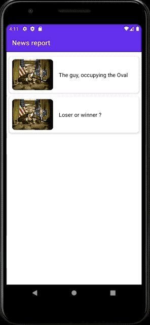
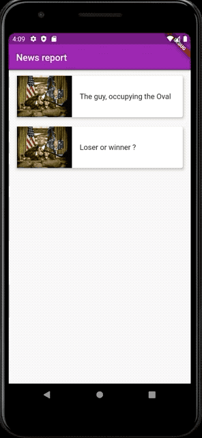

# Learning ground of Android Jetpack Compose

|  Compose   | Flutter  |
|  ----  | ----  |
|   |   |

#### Compare code efforts with Flutter

1. Show image
2. Show App-bar(topbar in Compose, appbar in Flutter)
3. Show render text and theme, styles...
4. App's navigation approach

|     |  Compose   | Flutter  |
|  ----  |  ----  | ----  |
| App entry point  | [MainActivity.kt](android/app/src/main/java/com/example/composelambda/MainActivity.kt)  |  [main.dart](flutter/lib/main.dart) |
| App's navigation   | [AppRouter.kt](android/app/src/main/java/com/example/composelambda/appNav/AppRouter.kt)  | [app_router.dart](flutter/lib/app_nav/app_router.dart) (flutter navigation 1.0)  |
| List UI  | [OverviewPage.kt](android/app/src/main/java/com/example/composelambda/pages/OverviewPage.kt)  | [overview_page.dart](flutter/lib/pages/overview_page.dart)  |
| Detail UI  | [DetailPage.kt](android/app/src/main/java/com/example/composelambda/pages/DetailPage.kt)  | [detail_page.dart](flutter/lib/pages/detail_page.dart)  |
| Screen transition  | call places `Crossfade` in [AppRouter.kt](android/app/src/main/java/com/example/composelambda/appNav/AppRouter.kt)   | call places [ScaleTransitionPageRoute](flutter/lib/transitions/customized_transition_route.dart) of [customized_transition_route](flutter/lib/transitions/customized_transition_route.dart) in [app_router.dart](flutter/lib/app_nav/app_router.dart)   |
| Simply state  | Check `delta` to change font-size in [DetailPage.kt](android/app/src/main/java/com/example/composelambda/pages/DetailPage.kt)  |  check `_delta` to change font-size [detail_page.dart](flutter/lib/pages/detail_page.dart). |
| Complex state | Check `AppTheme` [AppTheme.kt](android/app/src/main/java/com/example/composelambda/AppTheme.kt) and `BuildSwitchTheme` in [AppBar.kt](android/app/src/main/java/com/example/composelambda/pages/AppBar.kt) by using `AppThemeModel` | Check `ThemeApp` [app_theme.dart](flutter/lib/app_theme.dart) and `_buildSwitchTheme` in [app_bar.dart](flutter/lib/pages/app_bar.dart) by using `AppThemeModel`. |
